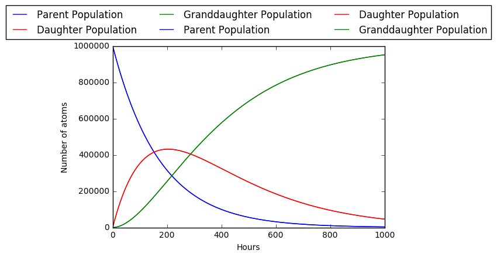

# decay_demo

Ricardo Lopez  
University of Michigan 
January 2019

The goal for this exercise is to gain experience with the basics of the Fortran coding language for possible use in future endeavors. This particular exercise will be modeling a simple radioactive decay of a parent nuclide to a daughter nuclide and eventually a stable granddaughter nuclide.

## Problem Explaination

The radioactive decay chain problem that will be worked out is as follows:

One is given that a parent nuclide has a half life of 5 days and a daughter nuclide has one of 7 days. The granddaughter is stable and the initial population of the parent nuclide is 1E6 while the populations of the daughter and granddaughter are 0. Show the behaviour of the three nuclide populations by plotting all three on top of one another.

## Coding in Python

The methods by which this problem was initially solved using Python can be seen in the jupyter notebook that contains the [Python portion of the exercise.](python_demo.ipynb) The final result is the following plot:

