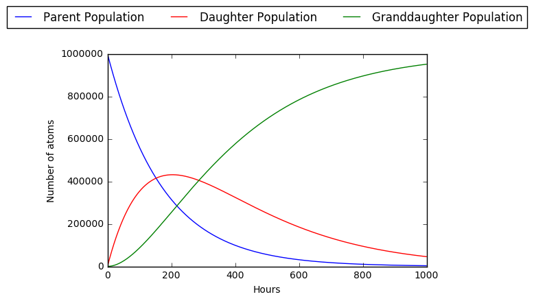

# decay_demo

Ricardo Lopez  
University of Michigan 
January 2019

The goal for this exercise is to gain experience with the basics of the Fortran coding language for possible use in future endeavors. This particular exercise will be modeling a simple radioactive decay of a parent nuclide to a daughter nuclide and eventually a stable granddaughter nuclide.

## Problem Explaination

The radioactive decay chain problem that will be worked out is as follows:

One is given that a parent nuclide has a half life of 5 days and a daughter nuclide has one of 7 days. The granddaughter is stable and the initial population of the parent nuclide is 1E6 while the populations of the daughter and granddaughter are 0. Show the behavior of the three nuclide populations by plotting all three on top of one another.

## Problem Setup

Before we begin coding the problem, we'll need to determine what expressions we will use in the code to obtain the populations at any time *t*. To do so we start witht the following differential equations that represent the scenario of the problem:

Solving the differential equations allows us to obtain the final expressions for the parent population [N1(t)], daughter population [N2(t)], and granddaughter population [N3(t)]:

## Coding in Python

The methods by which this problem was initially solved using Python can be seen in the jupyter notebook that contains the [Python portion of the exercise.](python_demo.ipynb) The final result is the following plot:

## Coding in Fortran
The Fortran file that contains the code may be found [here along with comments.](decay_chain.f) The output of the Fortran program is a .CSV file with the population of the the three nuclides in 1 hour increments. The raw file looks like so:

Using the raw data one can obtain a plot to compare with the one obtained from Python:

The final plot obtained from the Fortran data was in accordance with the expected behavior. Thus we conlcude that the exercise was a success as the desired reults were obtained using some basic Fortran coding!

